# Git Basic Mini Project 2
<p> This is a mini project to practice Git commands. </p>
<p> The project is aimed to help you understand the basic commands of Git. </p>

## Task 1: Create a new repository
1. Created a new repository on github and then cloned it to your local machine.
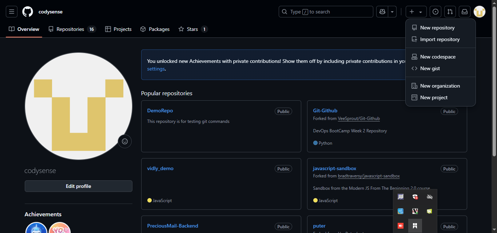

2. Cloning the repository.
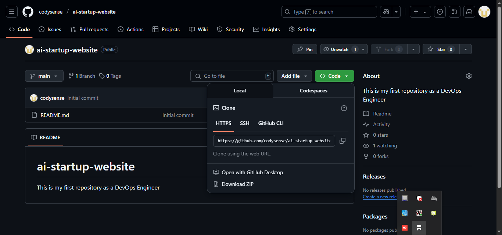

3. Created folder for the repo using `mkdir` command.


4. Moved to the cloned directory using `cd` command.

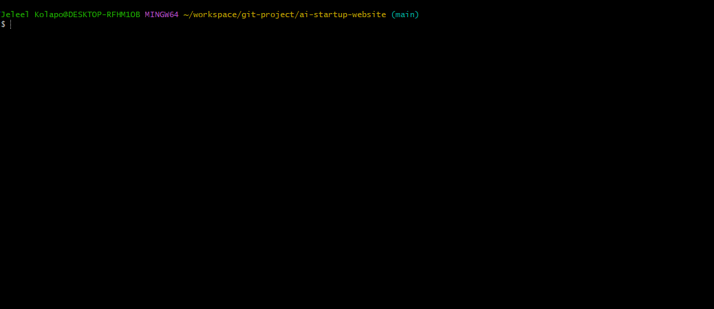

5. Created a new file using `touch` command.
```git touch <file-name>```
    <p> This command will create a new file in the current directory. </p>
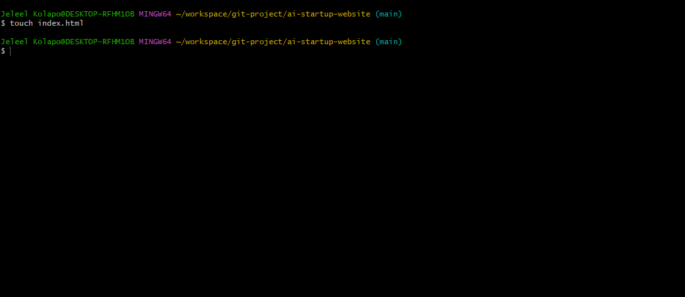

6. Checked the status of the repository using `git status` command.
```git status```
    <p> This command will show you the current status of the repository. </p>
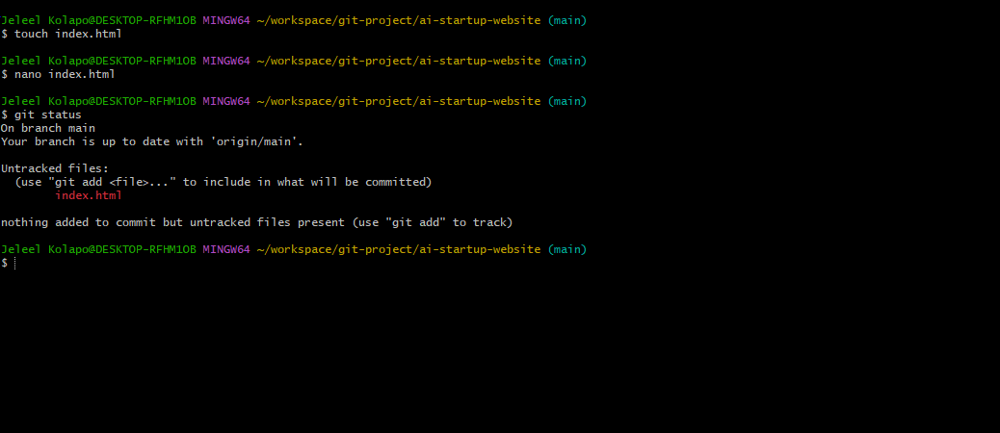

7. Added the file to the staging area using `git add` command.
```git add <file-name>```
    <p> This command will add the file to the staging area. </p>
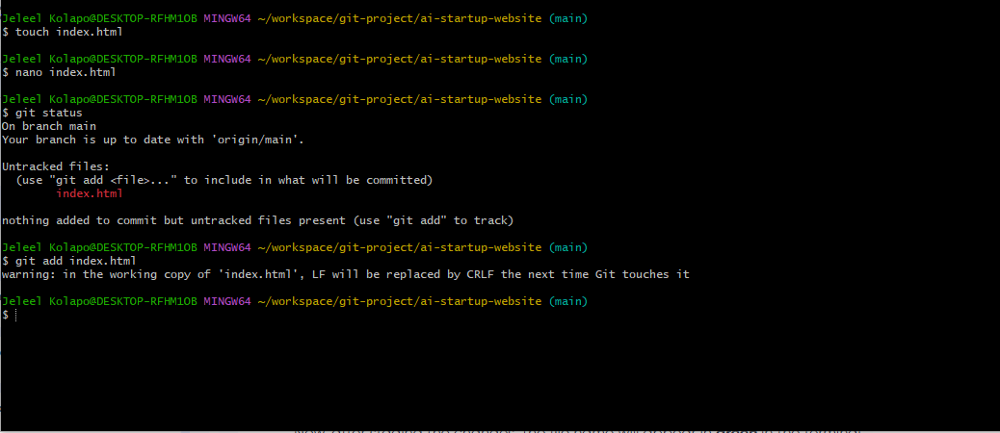

8. Committed the changes using `git commit` command.
```git commit -m "<commit-message>"```
    <p> This command will commit the changes to the repository. </p>
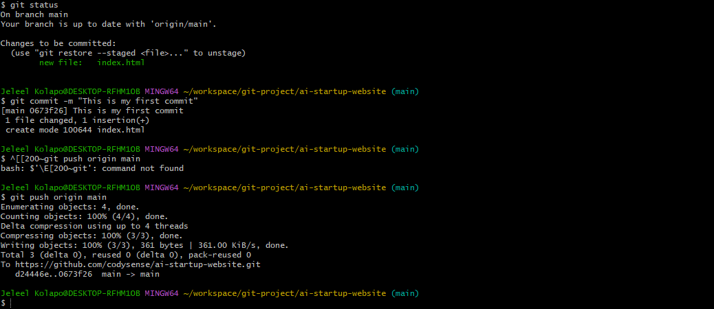


9. Check current branch using `git branch` command.
```git branch```
    <p> This command will show you the current branch. </p>
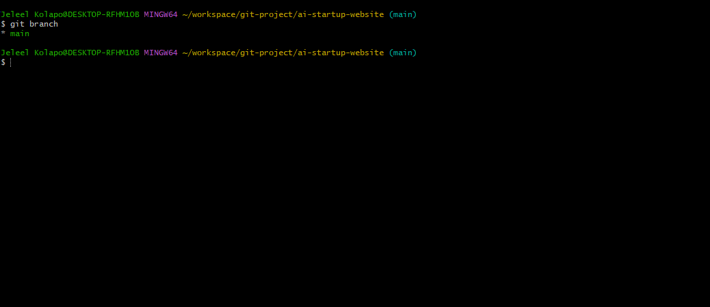

10. Created a new branch for Tom using `git checkout -b` command.
```git checkout -b <branch-name>```
    <p> This command will create a new branch and switch to it. </p>
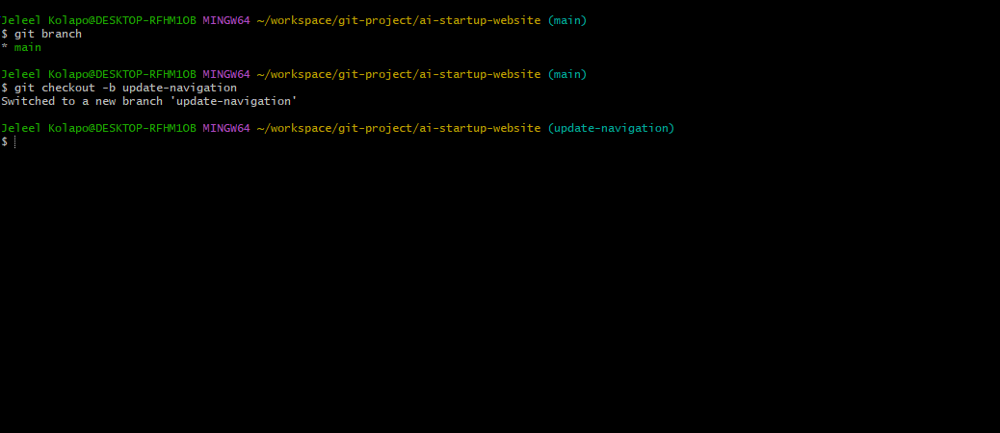

11. Confirmed the branch using `git branch` command.
```git branch```
    <p> This command will show you the current branch. </p>
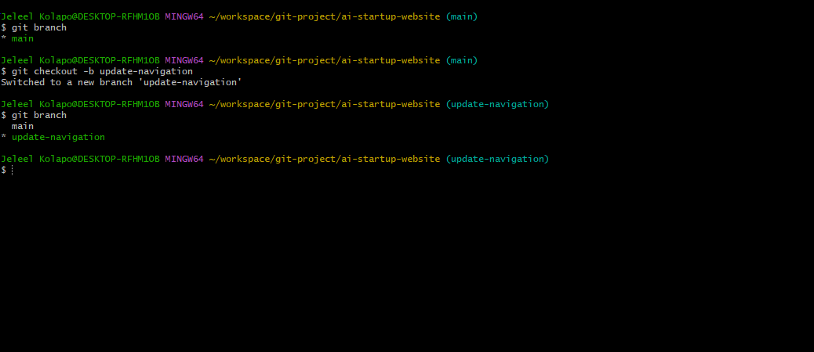

12. Editing the html file on Tom's branch.
```git touch <file-name>```
    <p> This command will create a new file in the current directory. </p>
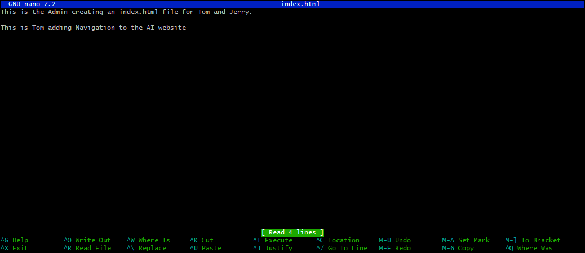

13. Confirmed the changes using `git status` command.
```git status```
    <p> This command will show you the current status of the repository. </p>
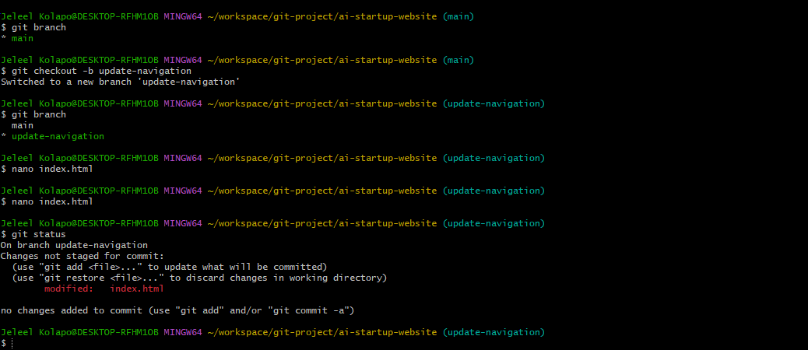

14. Added the changes to the staging area using `git add` command.
```git add <file-name>```
    <p> This command will add the file to the staging area. </p>
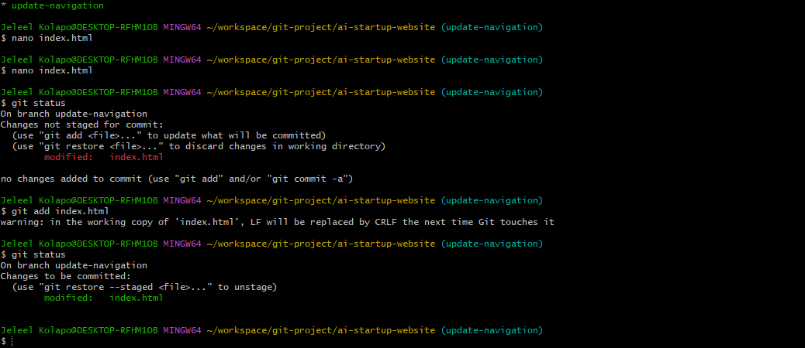

15. Commit and push the changes to the remote repository using `git commit` and `git push` commands.
```git commit -m "<commit-message>"```
```git push origin <branch-name>```
    <p> This command will commit the changes to the repository. </p>
    <p> This command will push the changes to the remote repository. </p>
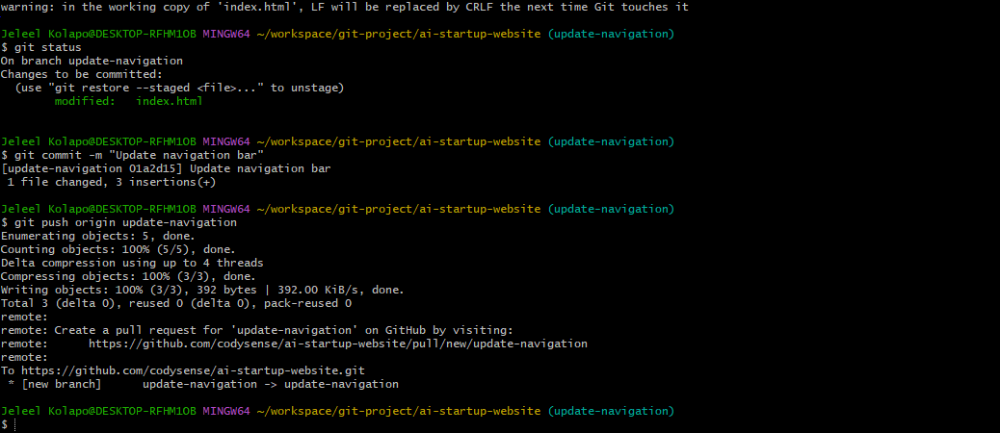

16. Switched back to the main branch using `git checkout` command and pull changes to get updated after Tom Branch push.
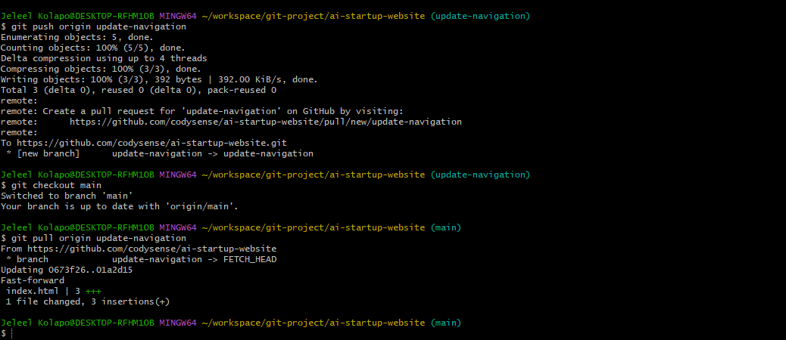


17. Checkout and switched to add-contact-info branch using `git checkout` command.
```git checkout <branch-name>```
    <p> This command will switch to the specified branch. </p>
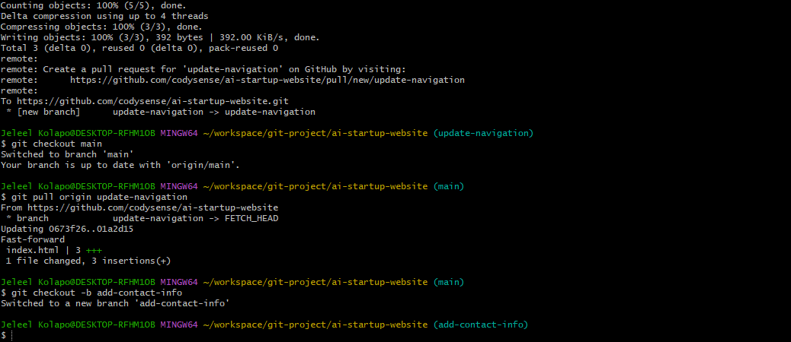

18. Adding contact information to index.html using nano commands


19. Staged and Commit contact info using 'git add file-name' and 'git commit -m 'message''

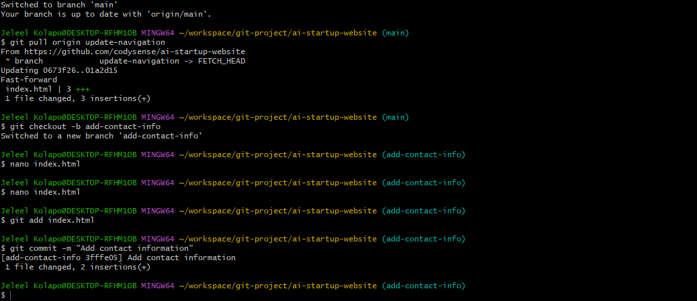

20. Push Jerry branch using 'git push origin'
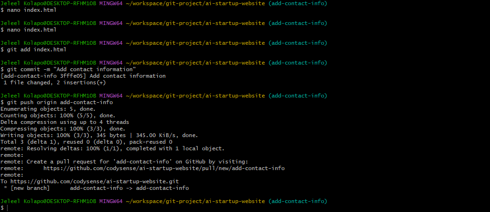


