# Mini Project 4 - Git Branching and Merging

## Task 1: Create Pull request for Tom branch and merge into main branch

1. Login to AI Startup Website Repo
   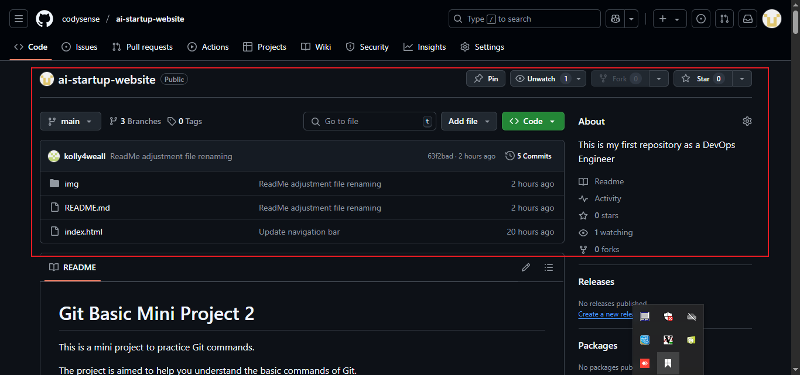

2. Switching to update-navigation branch
   

3. Confirm switch to update-navigatin branch
   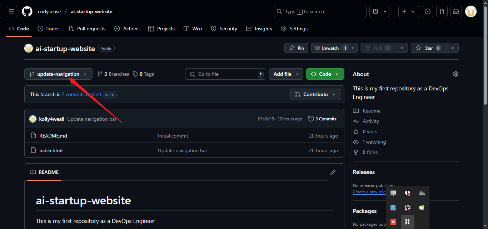

4. Create pull request for update-navigation branch
   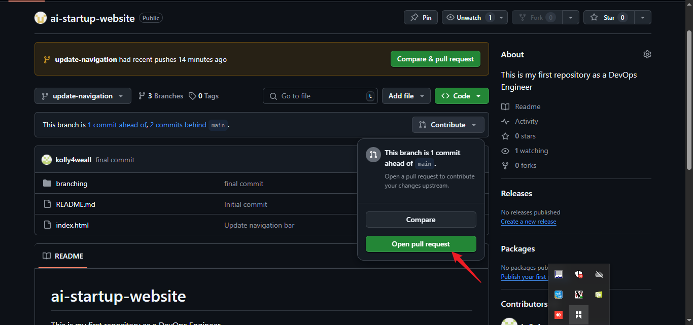

5. Review changes for update-navigation branch
   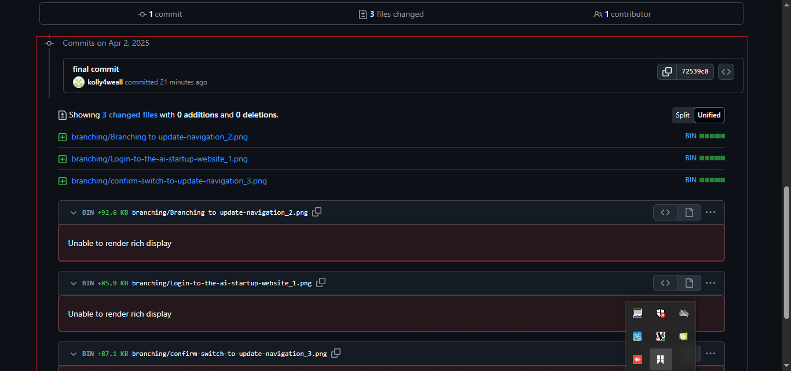

6. Create pull request after Tom review
   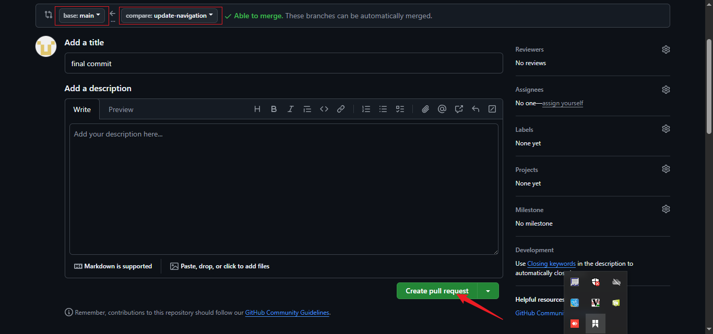

7. Merge update-navigation branch to main
   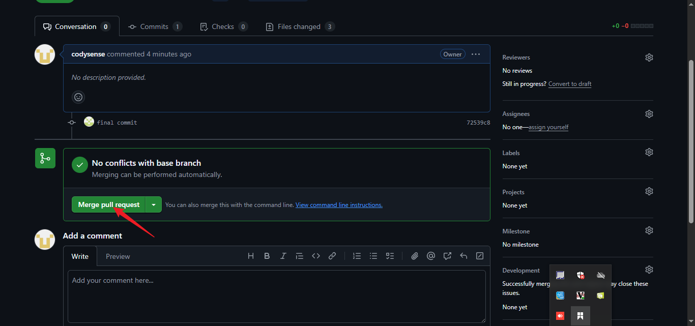

8. Merge update-navigation branch successfully
   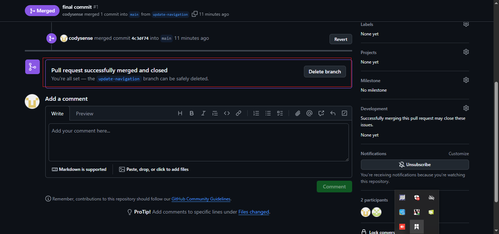

9. Switch to add-contact-info branch using 'git switch'
   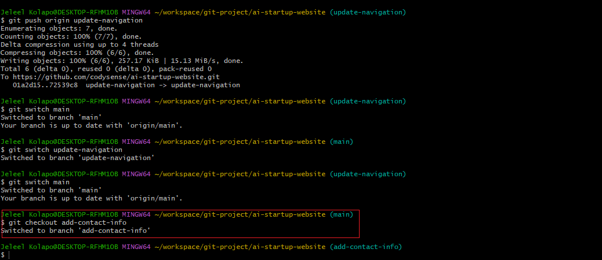

10. Push add-contact-info into main
    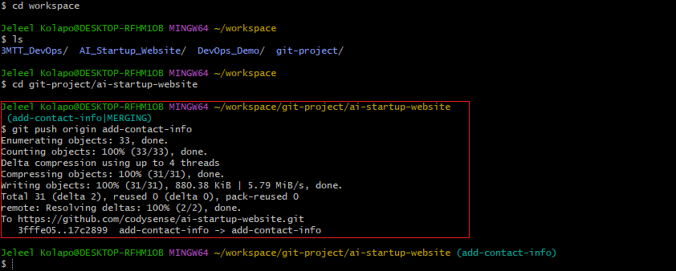

11. Create pull-request for add-contact-info branch
    

12. Merge add-contanct-info branch to main
    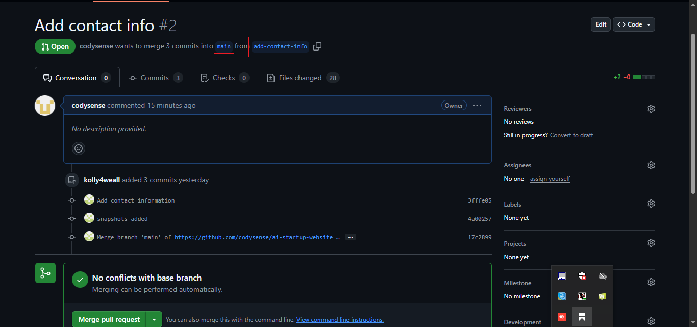

13. add-contact-info branch successfully
    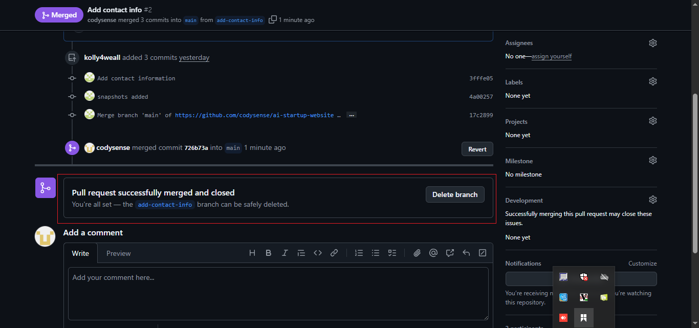
